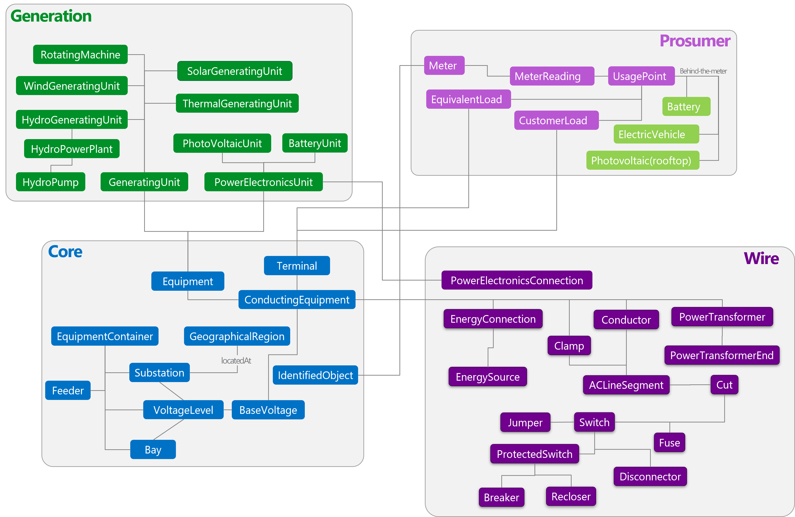

# Digital Twins Definition Language (DTDL) ontology for Energy Grid 

Domain ontologies are the foundational components to develop global solutions with industry standards. The Azure IoT engineering team has been collaborating with customers, domain experts, and industry-standard organizations to develop DTDL ontologies by leveraging  the existing industry ontologies and best practices. Earlier, we published the DTDL ontologies for smart buildings based on RealEstateCore, and for smart cities based on ETSI NGSI-LD. Today, we are releasing the energy grid ontology adapted from [Common Information Model (CIM)](https://cimug.ucaiug.org/Pages/About.aspx), a global standard for energy grid assets management, power system operations modeling and physical energy commodity market. The CIM-based DTDL ontology provides contextual understanding of data by identifying the properties of various grid entities and the relationships among them. Power & Utilities customers and partners can leverage as well as extend this open-source repository for their solutions and contribute their learnings to the repository for others to benefit from. 

The CIM organizes entities into distinct packages. In this first iteration, we have included core, wire, and generation packages, and prosumer-related entities from metering, customer, and Distributed Energy Resource (DER) packages. We have selected them based on the implemented and in-progress solutions, and on the collaborative decision of the extended team members of Agder Energi, Statnett, Sirus, FiWare, and Azure IoT. 
- **Core Package** contains the PowerSystemResource, ConductingEquipmen, and common collections of those entities shared by all applications. Most of the other packages have associations and generalizations that depend on the core package. 
- **Wire Package** is an extension to the Core that provides model information on the electrical characteristics of transmission and distribution networks. This package is used by network applications, such as state estimation, load flow, and optimal power flow. 
- **Generation Package** has information for unit commitment and economic dispatch of hydro and thermal generating units, load forecasting, automatic generation control, and unit modeling for training simulation. 
Last but not least – **prosumer** – we included various entities related to consumer and DER in the prosumer folder. For examples, EquivalentLoad, UsagePoints, and MeterReading.

If you need additional entities before the next iteration, please contact us. If you already have DTDL grid entities feel free to contribute them to the repo.   

# Contributing

This project welcomes contributions and suggestions.  Most contributions require you to agree to a
Contributor License Agreement (CLA) declaring that you have the right to, and actually do, grant us
the rights to use your contribution. For details, visit https://cla.opensource.microsoft.com.

When you submit a pull request, a CLA bot will automatically determine whether you need to provide
a CLA and decorate the PR appropriately (e.g., status check, comment). Simply follow the instructions
provided by the bot. You will only need to do this once across all repos using our CLA.

This project has adopted the [Microsoft Open Source Code of Conduct](https://opensource.microsoft.com/codeofconduct/).
For more information see the [Code of Conduct FAQ](https://opensource.microsoft.com/codeofconduct/faq/) or
contact [opencode@microsoft.com](mailto:opencode@microsoft.com) with any additional questions or comments.
